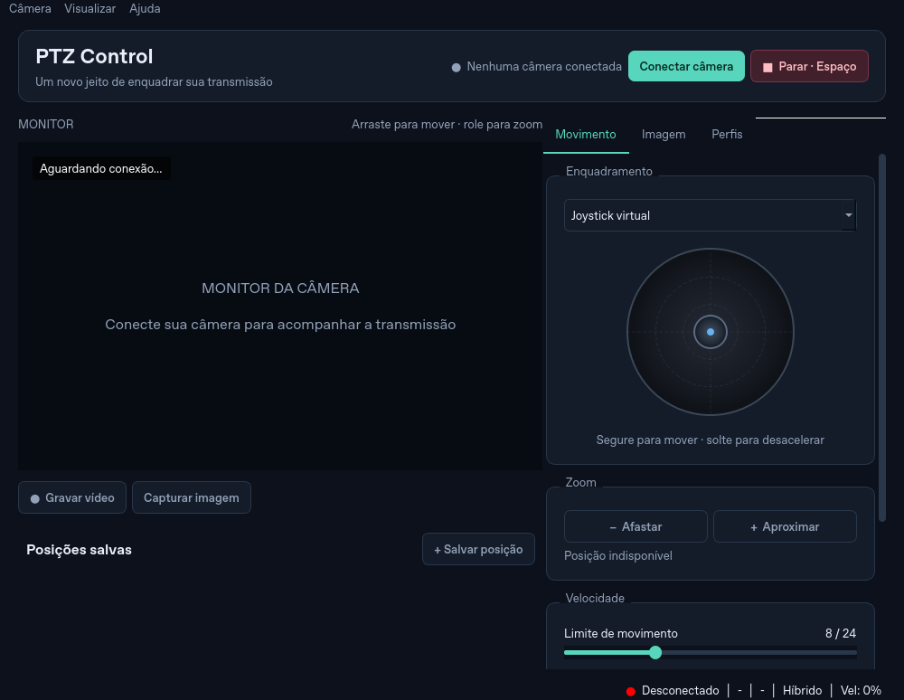

# PTZ Control

Aplicativo desktop em português para controlar câmeras PTZ pela rede, sem Internet Explorer ou plugin ActiveX. Desenvolvido em Python e PySide6, com prévia RTSP, teclado, mouse, joystick virtual e suporte opcional a controles USB/Bluetooth.



## Compatibilidade

| Recurso | Requisito |
| --- | --- |
| Movimento, zoom e foco | VISCA over IP com cabeçalho de 8 bytes, via UDP; faixa típica de pan 1–24 e tilt 1–20 |
| Movimento por HTTP | API Bolin/GXX-ISP `/apiv2/ptzctrl`; depende dos comandos disponíveis no firmware |
| Ajustes de imagem | API Bolin/GXX-ISP `/apiv2/video`; apenas os campos informados pela câmera são habilitados |
| Prévia e captura | RTSP compatível com FFmpeg ou com a instalação local do VLC |
| Gravação | FFmpeg no PATH; grava o vídeo original em MKV sem recodificar |
| Busca automática | WS-Discovery ONVIF na mesma rede local |
| Controle físico | `pygame-ce`, dispositivo reconhecido pelo sistema e eixos configurados na interface |

**Descobrir uma câmera por ONVIF não significa que o app controle qualquer câmera ONVIF.** O controle implementado é VISCA/Bolin. Câmeras antigas que não respondem à descoberta podem ser configuradas pelo IP. Não há dependência do antigo instalador do plugin.

A câmera real da igreja é um modelo chinês white label, sem marca informada, e ainda precisa ser validada. O modelo exato, os limites do sensor e os valores de exposição/balanço de branco podem variar por firmware. Use **Câmera → Exportar diagnóstico** para salvar os nomes dos campos e valores numéricos de sensor conhecidos, sem credenciais ou URL de stream. Esse arquivo ajuda a identificar o firmware de modelos white label.

A correção de imagem preserva campos desconhecidos e exige leitura de confirmação; ela não tenta adivinhar comandos de infravermelho ou dia/noite.

## Instalação

Use Python 3.10 ou superior, preferencialmente 3.12. Instale **FFmpeg** e confirme `ffmpeg -version` no terminal. Ele é recomendado para RTSP e necessário para gravação. VLC de mesma arquitetura do Python é uma alternativa para a prévia, e não substitui FFmpeg na gravação.

### Windows

```powershell
python -m venv .venv
.venv\Scripts\python.exe -m pip install -r requirements.txt
.venv\Scripts\python.exe main.py
```

Depois da instalação, `iniciar.bat` usa a `.venv` automaticamente. Instale FFmpeg seguindo as opções para Windows em [ffmpeg.org](https://ffmpeg.org/download.html), adicionando a pasta `bin` ao PATH. Reinicie o terminal depois de alterar o PATH.

### macOS

Com Homebrew:

```bash
brew install python@3.12 ffmpeg
python3.12 -m venv .venv
.venv/bin/python -m pip install -r requirements.txt
bash iniciar.sh
```

VLC é opcional: `brew install --cask vlc`. Trabalhe na pasta real do projeto; um atalho do Finder não contém o código.

### Linux

Instale FFmpeg e as bibliotecas gráficas do Qt pelo gerenciador da distribuição. Em Debian/Ubuntu:

```bash
sudo apt-get install ffmpeg libegl1 libxcb-cursor0 libxkbcommon-x11-0
python3 -m venv .venv
.venv/bin/python -m pip install -r requirements.txt
bash iniciar.sh
```

### Controle USB/Bluetooth

```bash
.venv/bin/python -m pip install -r requirements-gamepad.txt
```

No Windows, use `.venv\Scripts\python.exe` no lugar de `.venv/bin/python`. Na aba Movimento, selecione **Controle USB / Bluetooth** e configure os eixos horizontal, vertical e de zoom. O padrão é 0, 1 e 3; a numeração varia por dispositivo. O primeiro controle reconhecido é usado. O botão 0 para os movimentos. Após parar, trocar de modo, perder foco ou reconectar o dispositivo, centralize os eixos antes de retomar.

## Usar a câmera

1. Conecte o computador à mesma rede da câmera e clique em **Conectar câmera**.
2. Busque câmeras ou informe o IPv4 manualmente. Digite as credenciais da sua câmera.
3. Confira as portas: HTTP 80, VISCA/UDP 52381 e RTSP 554 são sugestões, não uma garantia para todos os modelos.
4. Use **Testar conexão** para verificar a resposta de protocolo e a autenticação HTTP. Uma porta aberta ou um socket UDP criado não contam como câmera conectada.
5. Conecte. Se o caminho padrão `/media/video1` não existir, informe a URL RTSP do fabricante.
6. Na aba **Imagem**, leia os valores, edite e clique em **Aplicar ajustes**. O app envia apenas alterações de campos suportados e verifica os valores retornados. Campos ausentes e modos desconhecidos ficam desativados.
7. Salve perfis para diferentes ambientes. Carregar um perfil prepara os ajustes; aplicar é uma ação separada.

Prévia e captura PNG usam resolução de 1280×720. A gravação mantém o codec e a resolução do stream original. Capturas e gravações ficam na pasta de dados do app, em `snapshots` e `recordings`; o caminho aparece na barra de status após uma captura.

As posições salvas podem ser criadas e chamadas pela interface. O nome local de um preset é específico ao IP configurado. VIA VISCA, o app informa envio de comando, sem afirmar que a câmera concluiu fisicamente o movimento.

### Atalhos

| Tecla | Ação |
| --- | --- |
| Setas ou W/A/S/D | Movimento enquanto a tecla estiver pressionada |
| Q/E/Z/C | Diagonais |
| PageUp/PageDown ou +/− | Zoom |
| Espaço | Parada imediata de pan, tilt, zoom e foco |
| 1–9 | Chamar posição |
| Ctrl + 1–9 | Solicitar salvamento da posição atual |
| F | Alternar modo solicitado de foco |
| [ / ] | Foco perto/longe |
| Ctrl+Z / Ctrl+Y | Desfazer/refazer o rascunho de imagem |
| Ctrl+R / Ctrl+P | Gravar / capturar |
| Ctrl+Shift+R | Ler ajustes de imagem |
| G / F11 / F1 | Grade / tela cheia / ajuda |

Campos de texto e números não acionam movimentos. Perder o foco da janela interrompe os controles. No modo de controle físico, os eixos substituem teclado e arrasto para movimento; atalhos de emergência e presets continuam disponíveis.

A compensação por zoom é **opcional e desativada inicialmente**. Ela usa uma leitura real de posição VISCA, sem estimar o zoom pelo tempo nem inventar uma ampliação de 20x. Ative somente em câmeras com faixa óptica compatível com `0x0000..0x4000`.

## Dados locais

O app não inicia conexão automática com um IP fixo. A senha fica em memória durante a sessão. Preferências e perfis não incluem a senha nem o usuário/senha embutidos na URL RTSP. Perfis antigos são reserializados sem essas credenciais ao exportar. Registros locais, caches, capturas, vídeos e perfis não entram no Git.

Os arquivos importados do ZIP incluem o código, testes e arquivos de execução. Foram excluídos caches Python, logs pessoais, instalador ActiveX e dumps da interface antiga que não são usados pelo aplicativo. O ZIP original permanece como material de origem na conversa.

## Desenvolvimento e testes

```bash
.venv/bin/python -m pip install -r requirements-dev.txt
QT_QPA_PLATFORM=offscreen .venv/bin/python -m pytest -q
```

Os testes usam diretórios temporários e servidores HTTP/UDP de loopback. Não acessam a câmera da igreja. Cobrem rampas em diferentes posições de zoom, diagonais VISCA, respostas antigas, paradas atrasadas, leitura/escrita de imagem, preservação de campos desconhecidos, credenciais, perfis, descoberta e entrada de controle físico simulada.

Para testar vídeo, gravação e captura com uma fonte RTSP local:

```bash
QT_QPA_PLATFORM=offscreen .venv/bin/python scripts/check-video.py rtsp://127.0.0.1:8554/demo
```

O script valida frames decodificados, captura e arquivo gravado com `ffprobe`. Não simula motores físicos. Consulte [a validação registrada](docs/VALIDATION.md) e [a arquitetura](docs/ARCHITECTURE.md).

### Codex na nuvem

Use o checkout existente: a tarefa já é isolada e não precisa de outro worktree. `bash scripts/setup-cloud.sh` prepara a `.venv` externa ao checkout e as bibliotecas VLC em `/workspace/ptz-system`, sem alterar pacotes do sistema. O helper é específico para Debian 13 amd64 e usa o repositório oficial com verificação APT preservada.

Antes de rodar comandos, use `. scripts/cloud-env.sh`. Execute testes com `QT_QPA_PLATFORM=offscreen`; o ambiente de onboarding não oferece uma janela desktop interativa nem acesso à câmera da rede da igreja. Processos de reprodução devem ser iniciados novamente em tarefas futuras.
